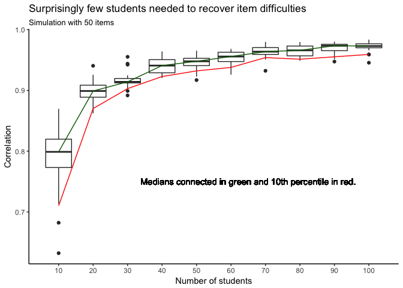

simulation\_recovering\_item\_difficulties
================

Background
==========

A simulation to figure out how many students are needed in order to recover item difficulties from the Rasch item response theory model.

We will use the tidyverse to keep all parameters, responses data, and estimates in a single data frame.

Part 1 sets up the simulation and generates responses data (varying numbers of students responding to 50 items with 0 = incorrect and 1 = correct). Part 2 fits the Rasch model and extracts the item difficulties. Part 3 visualizes the results.

``` r
library(tidyverse)
```

    ## ── Attaching packages ────────────────────────────────── tidyverse 1.2.1 ──

    ## ✔ ggplot2 2.2.1     ✔ purrr   0.2.4
    ## ✔ tibble  1.4.2     ✔ dplyr   0.7.4
    ## ✔ tidyr   0.7.2     ✔ stringr 1.2.0
    ## ✔ readr   1.1.1     ✔ forcats 0.2.0

    ## ── Conflicts ───────────────────────────────────── tidyverse_conflicts() ──
    ## ✖ dplyr::filter() masks stats::filter()
    ## ✖ dplyr::lag()    masks stats::lag()

``` r
library(mirt)
```

    ## Loading required package: stats4

    ## Loading required package: lattice

``` r
set.seed(1)
```

Part 1: Generating response data
================================

``` r
n_items <- 50

# create dataframe with the two inputs: number of students and item difficulties
(simulations <- data_frame(n_students = rep(1:10 * 10, each = 20)) %>% 
                mutate(item_difficulties = rerun(nrow(.), rnorm(n_items, mean = 0, sd = 1))))
```

    ## # A tibble: 200 x 2
    ##    n_students item_difficulties
    ##         <dbl> <list>           
    ##  1       10.0 <dbl [50]>       
    ##  2       10.0 <dbl [50]>       
    ##  3       10.0 <dbl [50]>       
    ##  4       10.0 <dbl [50]>       
    ##  5       10.0 <dbl [50]>       
    ##  6       10.0 <dbl [50]>       
    ##  7       10.0 <dbl [50]>       
    ##  8       10.0 <dbl [50]>       
    ##  9       10.0 <dbl [50]>       
    ## 10       10.0 <dbl [50]>       
    ## # ... with 190 more rows

``` r
# write a function to take those inputs and simulate item response data 
simulate_responses <- function(n_students, item_difficulties){
  # linking function
  inv_logit <- function(x) exp(x)/(1 + exp(x))
  
  while(TRUE){
    # in each matrix, rows are students, columns are items, and 
    # values are 0 for incorrect and 1 for correct response
    
    # simulate student abilities and use already simulated item difficulties
    student_ability_matrix <- matrix(rnorm(n_students), n_students, n_items, byrow = FALSE) 
    item_difficulties_matrix <- matrix(item_difficulties, n_students, n_items, byrow = TRUE)

    # calculate probability of correct response  
    probability_correct_matrix <- inv_logit(student_ability_matrix + item_difficulties_matrix)
    
    # compare probability to a uniform draw to simulate student responding to item
    random_uniform_matrix <- matrix(runif(n_items * n_students), n_students, n_items)
    responses <- ifelse(probability_correct_matrix > random_uniform_matrix, 1, 0) %>% 
      as.data.frame()
    
    # can't have item with all incorrect or all correct responses
    if(all(colSums(responses) != 0) & all(colSums(responses) != n_students)){
      return(responses)
    }
  }
}

# apply this function
simulations$responses <- simulations %>% pmap(simulate_responses)

# inputs and simulated data are well organized in our data frame
simulations
```

    ## # A tibble: 200 x 3
    ##    n_students item_difficulties responses             
    ##         <dbl> <list>            <list>                
    ##  1       10.0 <dbl [50]>        <data.frame [10 × 50]>
    ##  2       10.0 <dbl [50]>        <data.frame [10 × 50]>
    ##  3       10.0 <dbl [50]>        <data.frame [10 × 50]>
    ##  4       10.0 <dbl [50]>        <data.frame [10 × 50]>
    ##  5       10.0 <dbl [50]>        <data.frame [10 × 50]>
    ##  6       10.0 <dbl [50]>        <data.frame [10 × 50]>
    ##  7       10.0 <dbl [50]>        <data.frame [10 × 50]>
    ##  8       10.0 <dbl [50]>        <data.frame [10 × 50]>
    ##  9       10.0 <dbl [50]>        <data.frame [10 × 50]>
    ## 10       10.0 <dbl [50]>        <data.frame [10 × 50]>
    ## # ... with 190 more rows

Part 2: Fit model and extract estimated item difficulties
=========================================================

``` r
# write a function to take responses data, fit model, and extract estimated item difficulties
estimate_item_difficulties <- function(responses){
  irt_model <- mirt(data = responses, model = 1, itemtype = "Rasch", verbose = FALSE)
  
  coef(irt_model)[1:n_items] %>% 
    map_dbl(~ .[1, 2]) # a bit dangerous: estimated item difficulties are 2nd value
}

# apply that function
(simulations <- simulations %>% 
  mutate(item_difficulties_estimated = responses %>% map(estimate_item_difficulties)))
```

    ## # A tibble: 200 x 4
    ##    n_students item_difficulties responses              item_difficulties_…
    ##         <dbl> <list>            <list>                 <list>             
    ##  1       10.0 <dbl [50]>        <data.frame [10 × 50]> <dbl [50]>         
    ##  2       10.0 <dbl [50]>        <data.frame [10 × 50]> <dbl [50]>         
    ##  3       10.0 <dbl [50]>        <data.frame [10 × 50]> <dbl [50]>         
    ##  4       10.0 <dbl [50]>        <data.frame [10 × 50]> <dbl [50]>         
    ##  5       10.0 <dbl [50]>        <data.frame [10 × 50]> <dbl [50]>         
    ##  6       10.0 <dbl [50]>        <data.frame [10 × 50]> <dbl [50]>         
    ##  7       10.0 <dbl [50]>        <data.frame [10 × 50]> <dbl [50]>         
    ##  8       10.0 <dbl [50]>        <data.frame [10 × 50]> <dbl [50]>         
    ##  9       10.0 <dbl [50]>        <data.frame [10 × 50]> <dbl [50]>         
    ## 10       10.0 <dbl [50]>        <data.frame [10 × 50]> <dbl [50]>         
    ## # ... with 190 more rows

Part 3: Visualize results
=========================

``` r
simulations %>% 
  mutate(correlation = map2_dbl(item_difficulties, item_difficulties_estimated, cor)) %>% 
  ggplot(aes(x = n_students, group = n_students, y = correlation)) +
  geom_boxplot() + 
  labs(title = "Surprisingly few students needed to recover item difficulties", 
       subtitle = "Simulation with 50 items",
       x = "Number of students", y = "Correlation") +
  geom_text(aes(x = 65, y = 0.75, label = "Medians connected in green and 10th percentile in red.")) +
  scale_x_continuous(breaks = 1:10 * 10) +
  stat_summary(fun.y = median, geom = "line", color = "darkgreen", aes(group = 1)) + 
  stat_summary(fun.y = function(x){quantile(x, 0.10)}, geom = "line", color = "red", aes(group = 1)) +
  theme_classic()
```


