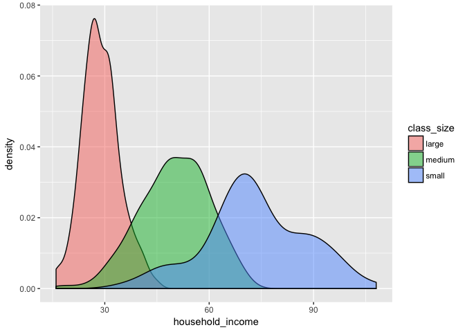
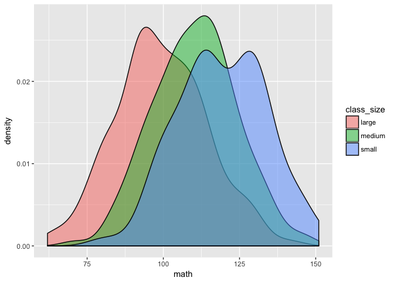

scores\_activity
================

Create the data
===============

``` r
n_small <- 80
n_medium <- 160
n_large <- 240
n_total <- n_small + n_medium + n_large

math <- data_frame(student_id = sample(n_total),
           class_size = c(rep("small", n_small), rep("medium", n_medium), rep("large", n_large)),
           household_income = c(rnorm(n_small, mean = 70, sd = 15), rnorm(n_medium, mean = 50, sd = 10), rnorm(n_large, mean = 30, sd = 5)) %>% round(),
           gender = sample(c("male", "female"), replace = TRUE, size = n_total),
           test_score = paste0("math_ss_", 
                               round(c(rnorm(n_small, mean = 105, sd = 15), rnorm(n_medium, mean = 100, sd = 15), rnorm(n_large, mean = 95, sd = 15)) + 
                                 household_income / 5 + rnorm(n_total)))) %>% 
             mutate(household_income = paste0(household_income, "k"))

english <- math %>% 
  mutate(test_score = paste0("reading_ss_", round((rnorm(n_total, mean = 100, sd = 15)))))

scores <- bind_rows(math, english) %>% 
  sample_frac()
  # mutate(test_score = ifelse(row_number() %in% sample(1:360, size = 15), NA, test_score))

scores %>% write_csv("scores.csv")
```

Background
==========

The principal of Warren Early College High School, Dr. Baker, experimented with three different class sizes this past year: small, medium, and large. She is interested in if class size seems to have an effect on math and reading test scores. The dataset scores includes information on the student, the class size they were in, and their math and reading scores. The scores are reported as standard scores which at the population level have a mean of 100 and a standard deviation of 15 (similar to popular IQ tests).

Cleaning
========

One thing you'll notice is that both household income and test scores are not stored as numbers. Start by finding a way to clean the data. In particular:

1.  Remove the k from household\_income to get just the number
2.  Make a math\_test\_score and a reading\_test\_score column and store a number in there (this will make the dataset half as long)

``` r
scores <- scores %>% 
  mutate(household_income = household_income %>% str_replace("k", "") %>% as.numeric(),
         test_name = test_score %>% str_extract("[:alpha:]+"),
         test_score = test_score %>% str_extract("\\d+") %>% as.numeric()) %>% 
  spread(key = test_name, value = test_score)
```

Explore generally
=================

Explore the scores dataset. At a minimum, be sure to answer the following questions:

-   How many students are in the dataset?
-   How many students are in each class size?
-   What is the gender breakdown? Does it appear to vary by class size?
-   What is the distribution of household incomes? Does it appear to vary by class size?
-   What is the distribution of test scores? Do they appear to vary by class size?

``` r
nrow(scores)
```

    ## [1] 480

``` r
scores %>% count(class_size)
```

    ## # A tibble: 3 x 2
    ##   class_size     n
    ##        <chr> <int>
    ## 1      large   240
    ## 2     medium   160
    ## 3      small    80

``` r
scores %>% count(gender)
```

    ## # A tibble: 2 x 2
    ##   gender     n
    ##    <chr> <int>
    ## 1 female   232
    ## 2   male   248

``` r
scores %>% count(class_size, gender)
```

    ## # A tibble: 6 x 3
    ##   class_size gender     n
    ##        <chr>  <chr> <int>
    ## 1      large female   113
    ## 2      large   male   127
    ## 3     medium female    86
    ## 4     medium   male    74
    ## 5      small female    33
    ## 6      small   male    47

``` r
scores %>% 
  ggplot(aes(x = household_income, fill = class_size)) +
  geom_density(alpha = 0.5)
```



``` r
scores %>% 
  ggplot(aes(x = math, fill = class_size)) +
  geom_density(alpha = 0.5)
```



``` r
scores %>% 
  ggplot(aes(x = reading, fill = class_size)) +
  geom_density(alpha = 0.5)
```


Math
====

Run a t-test to compare the small clase size math scores to the large class sizes math scores. What can you conclude?

``` r
t.test(math ~ class_size, var.equal = TRUE, data = scores %>% filter(class_size != "medium"))
```

    ## 
    ##  Two Sample t-test
    ## 
    ## data:  math by class_size
    ## t = -7.7351, df = 318, p-value = 1.377e-13
    ## alternative hypothesis: true difference in means is not equal to 0
    ## 95 percent confidence interval:
    ##  -19.30659 -11.47675
    ## sample estimates:
    ## mean in group large mean in group small 
    ##            100.9083            116.3000

Run an anova to see if math scores vary by class size. What can you conclude?

``` r
summary(aov(math~class_size, data = scores))
```

    ##              Df Sum Sq Mean Sq F value Pr(>F)    
    ## class_size    2  19110    9555   40.08 <2e-16 ***
    ## Residuals   477 113731     238                   
    ## ---
    ## Signif. codes:  0 '***' 0.001 '**' 0.01 '*' 0.05 '.' 0.1 ' ' 1

Run a regression with y = math and x = class\_size. How does this compare to the anova?

``` r
mod <- lm(math ~ class_size, data = scores)
summary(mod)
```

    ## 
    ## Call:
    ## lm(formula = math ~ class_size, data = scores)
    ## 
    ## Residuals:
    ##     Min      1Q  Median      3Q     Max 
    ## -38.300 -11.358   0.092  10.469  45.092 
    ## 
    ## Coefficients:
    ##                  Estimate Std. Error t value Pr(>|t|)    
    ## (Intercept)      100.9083     0.9967 101.240  < 2e-16 ***
    ## class_sizemedium  10.6229     1.5760   6.741 4.57e-11 ***
    ## class_sizesmall   15.3917     1.9934   7.721 6.83e-14 ***
    ## ---
    ## Signif. codes:  0 '***' 0.001 '**' 0.01 '*' 0.05 '.' 0.1 ' ' 1
    ## 
    ## Residual standard error: 15.44 on 477 degrees of freedom
    ## Multiple R-squared:  0.1439, Adjusted R-squared:  0.1403 
    ## F-statistic: 40.08 on 2 and 477 DF,  p-value: < 2.2e-16

Now add in household\_income as an independent variable into the regression. What changes? What can you conclude?

``` r
mod <- lm(math ~ class_size + household_income, data = scores)
summary(mod)
```

    ## 
    ## Call:
    ## lm(formula = math ~ class_size + household_income, data = scores)
    ## 
    ## Residuals:
    ##     Min      1Q  Median      3Q     Max 
    ## -38.600 -11.082   0.107  10.424  45.901 
    ## 
    ## Coefficients:
    ##                  Estimate Std. Error t value Pr(>|t|)    
    ## (Intercept)      92.22189    2.43336  37.899  < 2e-16 ***
    ## class_sizemedium  4.62956    2.18433   2.119 0.034570 *  
    ## class_sizesmall   3.47789    3.63079   0.958 0.338605    
    ## household_income  0.29174    0.07477   3.902 0.000109 ***
    ## ---
    ## Signif. codes:  0 '***' 0.001 '**' 0.01 '*' 0.05 '.' 0.1 ' ' 1
    ## 
    ## Residual standard error: 15.22 on 476 degrees of freedom
    ## Multiple R-squared:  0.1704, Adjusted R-squared:  0.1652 
    ## F-statistic: 32.59 on 3 and 476 DF,  p-value: < 2.2e-16

Add in gender as well. What can you conclude?

``` r
mod_math <- lm(math ~ class_size + household_income + gender, data = scores)
summary(mod)
```

    ## 
    ## Call:
    ## lm(formula = math ~ class_size + household_income, data = scores)
    ## 
    ## Residuals:
    ##     Min      1Q  Median      3Q     Max 
    ## -38.600 -11.082   0.107  10.424  45.901 
    ## 
    ## Coefficients:
    ##                  Estimate Std. Error t value Pr(>|t|)    
    ## (Intercept)      92.22189    2.43336  37.899  < 2e-16 ***
    ## class_sizemedium  4.62956    2.18433   2.119 0.034570 *  
    ## class_sizesmall   3.47789    3.63079   0.958 0.338605    
    ## household_income  0.29174    0.07477   3.902 0.000109 ***
    ## ---
    ## Signif. codes:  0 '***' 0.001 '**' 0.01 '*' 0.05 '.' 0.1 ' ' 1
    ## 
    ## Residual standard error: 15.22 on 476 degrees of freedom
    ## Multiple R-squared:  0.1704, Adjusted R-squared:  0.1652 
    ## F-statistic: 32.59 on 3 and 476 DF,  p-value: < 2.2e-16

Reading
=======

Run a regression to determine the effect of class size on reading. What do you find? How does it compare to math?

``` r
mod_reading <- lm(reading ~ class_size + household_income + gender, data = scores)
summary(mod)
```

    ## 
    ## Call:
    ## lm(formula = math ~ class_size + household_income, data = scores)
    ## 
    ## Residuals:
    ##     Min      1Q  Median      3Q     Max 
    ## -38.600 -11.082   0.107  10.424  45.901 
    ## 
    ## Coefficients:
    ##                  Estimate Std. Error t value Pr(>|t|)    
    ## (Intercept)      92.22189    2.43336  37.899  < 2e-16 ***
    ## class_sizemedium  4.62956    2.18433   2.119 0.034570 *  
    ## class_sizesmall   3.47789    3.63079   0.958 0.338605    
    ## household_income  0.29174    0.07477   3.902 0.000109 ***
    ## ---
    ## Signif. codes:  0 '***' 0.001 '**' 0.01 '*' 0.05 '.' 0.1 ' ' 1
    ## 
    ## Residual standard error: 15.22 on 476 degrees of freedom
    ## Multiple R-squared:  0.1704, Adjusted R-squared:  0.1652 
    ## F-statistic: 32.59 on 3 and 476 DF,  p-value: < 2.2e-16

Prediction
==========

Make a prediction for each of the following students math and reading scores:

-   Male, household income of 50k, in a small class size
-   Male, household income of 50k, in a medium class size
-   Male, household income of 50k, in a large class size

-   Female, household income of 100k, in a small class size
-   Female, household income of 100k, in a medium class size
-   Female, household income of 100k, in a large class size

``` r
data_to_predict <- tribble(
  ~gender, ~household_income, ~class_size,
  "male",     50,    "small",
  "male",     50,    "medium",
  "male",     50,    "large",
  "female",   100,    "small",
  "female",   100,    "medium",
  "female",   100,    "large"
)

data_to_predict %>% 
  add_predictions(mod_math, "pred_math") %>% 
  add_predictions(mod_reading, "pred_reading") %>% 
  mutate_if(is.numeric, round)
```

    ## # A tibble: 6 x 5
    ##   gender household_income class_size pred_math pred_reading
    ##    <chr>            <dbl>      <chr>     <dbl>        <dbl>
    ## 1   male               50      small       110          101
    ## 2   male               50     medium       111           99
    ## 3   male               50      large       107          103
    ## 4 female              100      small       125          107
    ## 5 female              100     medium       126          105
    ## 6 female              100      large       121          109

Suggestion
==========

Time to make a decision. It costs the school 4k a year to have a kid in a small class size for the year, 3k a year for a medium class size, and 2k a year for a large class size. What size classes would you suggest the school uses for their students. Why? Be sure to consider other uses of school funds.
