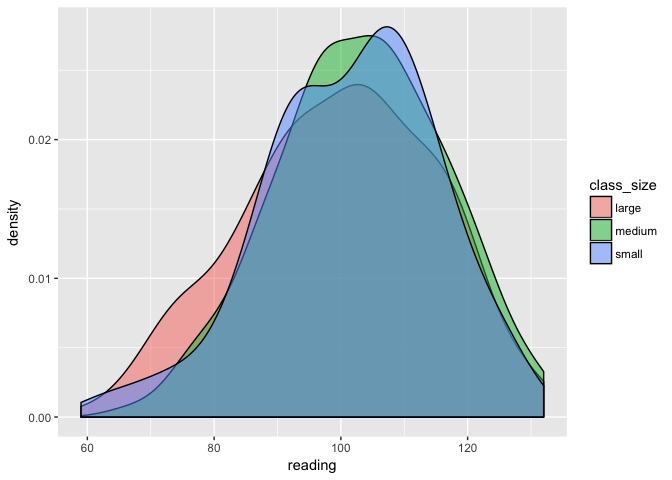

scores\_activity
================

Create the data
===============

``` r
# n_small <- 80
# n_medium <- 160
# n_large <- 240
# n_total <- n_small + n_medium + n_large
# 
# math <- data_frame(student_id = sample(n_total),
#            class_size = c(rep("small", n_small), rep("medium", n_medium), rep("large", n_large)),
#            household_income = c(rnorm(n_small, mean = 70, sd = 15), rnorm(n_medium, mean = 50, sd = 10), rnorm(n_large, mean = 30, sd = 5)) %>% round(),
#            gender = sample(c("male", "female"), replace = TRUE, size = n_total),
#            test_score = paste0("math_ss_", 
#                                round(c(rnorm(n_small, mean = 105, sd = 15), rnorm(n_medium, mean = 100, sd = 15), rnorm(n_large, mean = 95, sd = 15)) + 
#                                  household_income / 5 + rnorm(n_total)))) %>% 
#              mutate(household_income = paste0(household_income, "k"))
# 
# english <- math %>% 
#   mutate(test_score = paste0("reading_ss_", round((rnorm(n_total, mean = 100, sd = 15)))))
# 
# scores <- bind_rows(math, english) %>% 
#   sample_frac()
#   # mutate(test_score = ifelse(row_number() %in% sample(1:360, size = 15), NA, test_score))
# 
# scores %>% write_csv("scores.csv")

scores <- read_csv("/Users/benstenhaug/Google Drive/Stanford/Stanford Teaching/Data/scores.csv")
```

    ## Parsed with column specification:
    ## cols(
    ##   student_id = col_integer(),
    ##   class_size = col_character(),
    ##   household_income = col_character(),
    ##   gender = col_character(),
    ##   test_score = col_character()
    ## )

Background
==========

The principal of Warren Early College High School, Dr. Baker, experimented with three different class sizes this past year: small, medium, and large. She is interested in if class size seems to have an effect on math and reading test scores. The dataset scores includes information on the student, the class size they were in, and their math and reading scores. The scores are reported as standard scores which at the population level have a mean of 100 and a standard deviation of 15 (similar to popular IQ tests).

Cleaning
========

One thing you'll notice is that both household income and test scores are not stored as numbers. Start by finding a way to clean the data. In particular:

1.  Remove the k from household\_income to get just the number
2.  Make a math\_test\_score and a reading\_test\_score column and store a number in there (this will make the dataset half as long)

``` r
scores <- scores %>% 
  mutate(household_income = household_income %>% str_replace("k", "") %>% as.numeric(),
         test_name = test_score %>% str_extract("[:alpha:]+"),
         test_score = test_score %>% str_extract("\\d+") %>% as.numeric()) %>% 
  spread(key = test_name, value = test_score)

scores
```

    ## # A tibble: 480 x 6
    ##    student_id class_size household_income gender  math reading
    ##  *      <int>      <chr>            <dbl>  <chr> <dbl>   <dbl>
    ##  1          1     medium               62   male   119      93
    ##  2          2      small               88   male   143      84
    ##  3          3      large               30   male    89     109
    ##  4          4      large               24   male   108     100
    ##  5          5     medium               57 female    71      98
    ##  6          6      large               34 female   101     109
    ##  7          7      small               67 female   110     106
    ##  8          8     medium               43 female    99     121
    ##  9          9      large               38 female   103      91
    ## 10         10      small               74 female   110      93
    ## # ... with 470 more rows

Explore generally
=================

Explore the scores dataset. At a minimum, be sure to answer the following questions:

-   How many students are in the dataset?
-   How many students are in each class size?
-   What is the gender breakdown? Does it appear to vary by class size?
-   What is the distribution of household incomes? Does it appear to vary by class size?
-   What is the distribution of test scores? Do they appear to vary by class size?

``` r
nrow(scores)
```

    ## [1] 480

``` r
scores %>% count(class_size)
```

    ## # A tibble: 3 x 2
    ##   class_size     n
    ##        <chr> <int>
    ## 1      large   240
    ## 2     medium   160
    ## 3      small    80

``` r
scores %>% count(gender)
```

    ## # A tibble: 2 x 2
    ##   gender     n
    ##    <chr> <int>
    ## 1 female   227
    ## 2   male   253

``` r
scores %>% count(class_size, gender)
```

    ## # A tibble: 6 x 3
    ##   class_size gender     n
    ##        <chr>  <chr> <int>
    ## 1      large female   115
    ## 2      large   male   125
    ## 3     medium female    67
    ## 4     medium   male    93
    ## 5      small female    45
    ## 6      small   male    35

``` r
scores %>% 
  ggplot(aes(x = household_income, fill = class_size)) +
  geom_density(alpha = 0.5)
```


``` r
scores %>% 
  ggplot(aes(x = math, fill = class_size)) +
  geom_density(alpha = 0.5)
```


``` r
scores %>% 
  ggplot(aes(x = reading, fill = class_size)) +
  geom_density(alpha = 0.5)
```



Math
====

Run a t-test to compare the small clase size math scores to the large class sizes math scores. What can you conclude?

-   The t-test tells us that the means of these two groups are statistically different.

``` r
t.test(math ~ class_size, var.equal = TRUE, data = scores %>% filter(class_size != "medium"))
```

    ## 
    ##  Two Sample t-test
    ## 
    ## data:  math by class_size
    ## t = -10.467, df = 318, p-value < 2.2e-16
    ## alternative hypothesis: true difference in means is not equal to 0
    ## 95 percent confidence interval:
    ##  -23.69487 -16.19679
    ## sample estimates:
    ## mean in group large mean in group small 
    ##            99.26667           119.21250

Run an anova to see if math scores vary by class size. What can you conclude?

-   The anova (analysis of variance) tells us that the means of these three groups are not the same. For exactly, the following is false: mean\_small == mean\_medium == mean\_large.

``` r
summary(aov(math~class_size, data = scores))
```

    ##              Df Sum Sq Mean Sq F value Pr(>F)    
    ## class_size    2  27925   13963   67.41 <2e-16 ***
    ## Residuals   477  98807     207                   
    ## ---
    ## Signif. codes:  0 '***' 0.001 '**' 0.01 '*' 0.05 '.' 0.1 ' ' 1

Run a regression with y = math and x = class\_size. How does this compare to the anova?

-   This gives us the exact same p-value. It also provides us additional information. The intercept is the mean of the large class. The estimate for class size medium is the increase in test scores for medium classes and so on.

``` r
mod_math <- lm(math ~ class_size, data = scores)
summary(mod_math)
```

    ## 
    ## Call:
    ## lm(formula = math ~ class_size, data = scores)
    ## 
    ## Residuals:
    ##     Min      1Q  Median      3Q     Max 
    ## -39.419  -9.267  -0.267   9.733  43.733 
    ## 
    ## Coefficients:
    ##                  Estimate Std. Error t value Pr(>|t|)    
    ## (Intercept)        99.267      0.929 106.850  < 2e-16 ***
    ## class_sizemedium   11.152      1.469   7.592 1.67e-13 ***
    ## class_sizesmall    19.946      1.858  10.735  < 2e-16 ***
    ## ---
    ## Signif. codes:  0 '***' 0.001 '**' 0.01 '*' 0.05 '.' 0.1 ' ' 1
    ## 
    ## Residual standard error: 14.39 on 477 degrees of freedom
    ## Multiple R-squared:  0.2203, Adjusted R-squared:  0.2171 
    ## F-statistic: 67.41 on 2 and 477 DF,  p-value: < 2.2e-16

Now add in household\_income as an independent variable into the regression. What changes? What can you conclude?

-   This is very important! Remember that household income was greater for students in small classes. We see here that higher household income looks to associate with better test scores. By adding it into the regression model, we control for household income. This reduces the effect of medium class size for example (from 11.1 to 8.6) but it is still significantly greater than 0.

``` r
mod_math <- lm(math ~ class_size + household_income, data = scores)
summary(mod_math)
```

    ## 
    ## Call:
    ## lm(formula = math ~ class_size + household_income, data = scores)
    ## 
    ## Residuals:
    ##     Min      1Q  Median      3Q     Max 
    ## -40.260  -9.679  -0.380   9.610  43.477 
    ## 
    ## Coefficients:
    ##                  Estimate Std. Error t value Pr(>|t|)    
    ## (Intercept)      95.75478    2.30200  41.596  < 2e-16 ***
    ## class_sizemedium  8.57554    2.13055   4.025 6.63e-05 ***
    ## class_sizesmall  14.55719    3.72713   3.906 0.000108 ***
    ## household_income  0.12157    0.07294   1.667 0.096214 .  
    ## ---
    ## Signif. codes:  0 '***' 0.001 '**' 0.01 '*' 0.05 '.' 0.1 ' ' 1
    ## 
    ## Residual standard error: 14.37 on 476 degrees of freedom
    ## Multiple R-squared:  0.2249, Adjusted R-squared:   0.22 
    ## F-statistic: 46.03 on 3 and 476 DF,  p-value: < 2.2e-16

Add in gender as well. What can you conclude?

-   Gender doesn't seem to be associated with test score so including it in the model doesns't have much of an impact.

``` r
mod_math <- lm(math ~ class_size + household_income + gender, data = scores)
summary(mod_math)
```

    ## 
    ## Call:
    ## lm(formula = math ~ class_size + household_income + gender, data = scores)
    ## 
    ## Residuals:
    ##     Min      1Q  Median      3Q     Max 
    ## -40.324  -9.653  -0.332   9.587  43.417 
    ## 
    ## Coefficients:
    ##                  Estimate Std. Error t value Pr(>|t|)    
    ## (Intercept)      95.82476    2.44037  39.267  < 2e-16 ***
    ## class_sizemedium  8.58980    2.13905   4.016 6.89e-05 ***
    ## class_sizesmall  14.56286    3.73158   3.903 0.000109 ***
    ## household_income  0.12123    0.07312   1.658 0.097996 .  
    ## gendermale       -0.11525    1.32284  -0.087 0.930608    
    ## ---
    ## Signif. codes:  0 '***' 0.001 '**' 0.01 '*' 0.05 '.' 0.1 ' ' 1
    ## 
    ## Residual standard error: 14.38 on 475 degrees of freedom
    ## Multiple R-squared:  0.2249, Adjusted R-squared:  0.2184 
    ## F-statistic: 34.45 on 4 and 475 DF,  p-value: < 2.2e-16

Reading
=======

Run a regression to determine the effect of class size on reading. What do you find? How does it compare to math?

-   There is significantly less effect if any of class size on reading scores. Interesting to think about why this might be.

``` r
mod_reading <- lm(reading ~ class_size + household_income + gender, data = scores)
summary(mod_reading)
```

    ## 
    ## Call:
    ## lm(formula = reading ~ class_size + household_income + gender, 
    ##     data = scores)
    ## 
    ## Residuals:
    ##     Min      1Q  Median      3Q     Max 
    ## -41.873  -9.646   1.337  10.393  30.414 
    ## 
    ## Coefficients:
    ##                  Estimate Std. Error t value Pr(>|t|)    
    ## (Intercept)      99.60581    2.40266  41.456   <2e-16 ***
    ## class_sizemedium  4.15645    2.10600   1.974   0.0490 *  
    ## class_sizesmall   4.08874    3.67393   1.113   0.2663    
    ## household_income -0.04441    0.07199  -0.617   0.5376    
    ## gendermale        2.64392    1.30240   2.030   0.0429 *  
    ## ---
    ## Signif. codes:  0 '***' 0.001 '**' 0.01 '*' 0.05 '.' 0.1 ' ' 1
    ## 
    ## Residual standard error: 14.16 on 475 degrees of freedom
    ## Multiple R-squared:  0.02103,    Adjusted R-squared:  0.01279 
    ## F-statistic: 2.552 on 4 and 475 DF,  p-value: 0.03847

Prediction
==========

Make a prediction for each of the following students math and reading scores:

-   Male, household income of 50k, in a small class size
-   Male, household income of 50k, in a medium class size
-   Male, household income of 50k, in a large class size

-   Female, household income of 100k, in a small class size
-   Female, household income of 100k, in a medium class size
-   Female, household income of 100k, in a large class size

``` r
data_to_predict <- tribble(
  ~gender, ~household_income, ~class_size,
  "male",     50,    "small",
  "male",     50,    "medium",
  "male",     50,    "large",
  "female",   100,    "small",
  "female",   100,    "medium",
  "female",   100,    "large"
)

data_to_predict %>% 
  add_predictions(mod_math, "pred_math") %>% 
  add_predictions(mod_reading, "pred_reading") %>% 
  mutate_if(is.numeric, round)
```

    ## # A tibble: 6 x 5
    ##   gender household_income class_size pred_math pred_reading
    ##    <chr>            <dbl>      <chr>     <dbl>        <dbl>
    ## 1   male               50      small       116          104
    ## 2   male               50     medium       110          104
    ## 3   male               50      large       102          100
    ## 4 female              100      small       123           99
    ## 5 female              100     medium       117           99
    ## 6 female              100      large       108           95

Suggestion
==========

Time to make a decision. It costs the school 4k a year to have a kid in a small class size for the year, 3k a year for a medium class size, and 2k a year for a large class size. What size classes would you suggest the school uses for their students. Why? Be sure to consider other uses of school funds.

-   This is a really interesting question. It all depends on what you estimate a 10 point increase in math test scores to be worth economically in the long-term which seems very difficult to estimate. Also depends on what other interventions instead of changing class size that one might help math scores.
